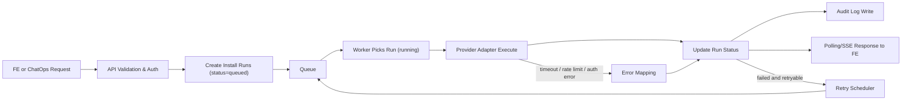
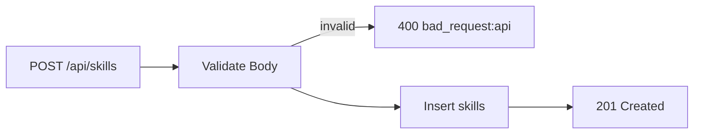
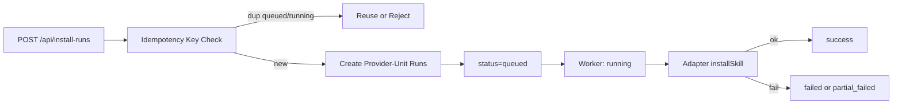
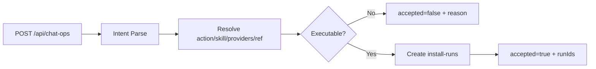

# Backend Feature Breakdown & Visual Flow

## 1) 기능별 작업 분해

| 기능 | 목표 | 주요 API/모듈 | 핵심 작업 | 완료 기준 |
|---|---|---|---|---|
| Skill 관리 | Skill 등록/조회의 안정적 제공 | `GET/POST /api/skills`, `skills` table | 스키마/마이그레이션, 검색/페이지네이션, 입력 검증, 에러코드 표준화 | Skill 생성 후 즉시 조회 가능, invalid 요청 4xx 처리 |
| Provider 연결 관리 | 설치 대상 provider 상태 관리 | `GET/POST/PATCH /api/providers`, `providers` table | provider 연결 검증, 활성/비활성 상태 전환, 연결 실패 사유 저장 | provider 상태 조회/갱신 가능, 연결 실패 원인 확인 가능 |
| Install Run 오케스트레이션 | 비동기 설치 실행 파이프라인 | `POST/GET /api/install-runs`, worker, queue, `install_runs` table | run 생성(`202`), 상태 전이(`queued/running/success/failed/partial_failed`), timeout/retry, 멱등 키 처리 | 요청 후 run 상태가 정상 전이되고 polling으로 추적 가능 |
| Provider Adapter 계층 | provider별 API 차이 캡슐화 | `ProviderAdapter`, registry, `lib/providers/*` | OpenAI/Claude/Gemini adapter, 에러 매핑, 연결 검증, status 조회 | 앱 레벨 코드가 SDK 직접 호출 없이 adapter만 사용 |
| ChatOps 실행 | 자연어 명령을 동일 파이프라인으로 실행 | `POST /api/chat-ops`, `chat_actions` table | intent 파싱/검증, 실행 가능성 판단, run 생성 연계, 감사로그 저장 | `accepted true/false`와 runIds가 계약대로 반환 |
| 운영/보안/감사 | 장애 대응과 추적성 확보 | audit log, watchdog, auth, error mapping | 인증/인가(401/403), 감사로그 표준 필드, 장기 running 감지, 공통 에러 응답 | 장애 분석 가능한 로그 확보, 운영 알림 트리거 동작 |

## 2) 구현 흐름도 (End-to-End)

## 3) 기능별 세부 흐름

### 3.1 Skill 관리

### 3.2 Install Run 생성/실행

### 3.3 ChatOps

## 4) 우선순위 실행 순서 (권장)
1. 데이터 계층: `skills/providers/install_runs/chat_actions` 마이그레이션 + 인덱스
2. API 최소 세트: `skills`, `install-runs` 생성/조회
3. Worker mock: 상태 전이 + 기본 에러/타임아웃 처리
4. Adapter 골격: registry + OpenAI 우선 구현
5. ChatOps 연결: run 생성 파이프라인 재사용
6. 운영 강화: 감사로그, retry/watchdog, partial_failed 집계

## 5) 산출물 체크리스트
- `DB`: 마이그레이션 파일 + 초기 seed(옵션)
- `API`: route handler + request/response schema
- `Worker`: run processor + retry scheduler
- `Adapter`: provider별 구현 + 공통 에러 매핑
- `Ops`: 감사로그 테이블/기록기, watchdog 잡
- `Test`: API 계약 테스트, 상태 전이 테스트, adapter 매핑 테스트

## 6) 보고 요약
- 기능은 6개 트랙으로 분리해 병렬 개발 가능하다.
- 핵심 경로는 `요청 검증 -> run 생성 -> worker 실행 -> 상태/로그 반영`이며, ChatOps도 동일 파이프라인을 사용한다.
- 구현 리스크는 provider 차이와 장기 실행 고착이며, adapter 표준화 + timeout/retry/watchdog로 제어한다.
